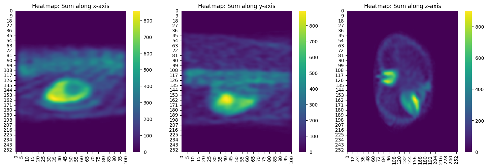
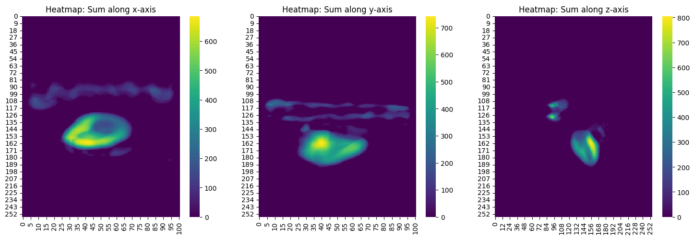
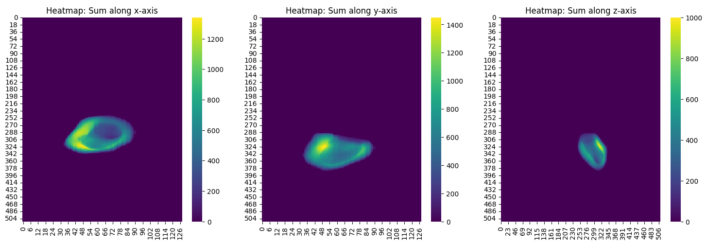

# SpectQuant

SpectQuant is a specialized package designed for the feature extraction of special photon emission computer tomography (SPECT) data.
It leverages advanced algorithms known from signal processing and methodologies to standardized results with the potential for scaled data mining.
*Note*: Package has been desigend particularly for assessing treatment response of cardiac amyloidosis.

Special Photon Emission Computer Tomography (SPECT) is an imaging technique that allows for the visualization of functional processes in the body. It involves the detection of gamma rays emitted by a radioactive tracer injected into the patient. The quantitative analysis of SPECT data is crucial for accurate diagnosis and research.

The key steps in the quantitative analysis of SPECT data include:

1. **Data Processing**: Preprocessing the original data by correcting for False Positives, and normalized voxel scores accross images, and image size.
2. **Feature Extraction**: Measuring the concentration of the tracer in different regions of the body.
3. **Visualization**: Creating visual representations of the processed data to facilitate interpretation and quick validity assessment. 

## SUV (Standardized Uptake Value)
For determining the SUV
Given a predefined 3D area $A$ (ROI = region of interest) of size $a \cdot a \cdot a$ and a predefined cubic kernel $\kappa$ (3D-window) of size $k \cdot k \cdot k$, the **SUV peak** is given by the cube (also of size $k \cdot k \cdot k$) at the location where the sum (or mean) of values in $\kappa$ is the highest.

$\forall \alpha_1, \alpha_2, \alpha_3 \in \{0, \dots, a\}:$
$$
    \text{SUV}^{peak} = max\left(\frac{\sum_{\alpha_1, \alpha_2, \alpha_3}^a \kappa}{k \cdot k \cdot k}\right)
$$
Essentially, the kernel tries every possible position for $\alpha_{\{1,2,3\}}$ from $1, \dots, a$ within area $A$ and yields the spot where the kernel $\kappa$ reaches is maximum sum. Then, the arithmetic average is taken from that by dividing by the number of *voxels* in $\kappa$.
This concept alos applies to *non-quibic* ROIs.

## TBR (Target to Blood/Background Ratio)
$$
\text{TBR \{peak, mean, mode\}} = \frac{\text{SUV \{peak, mean, mode\}}}{\text{SUV mean vena cava inferior}}
$$

## Retention Index
$$
\text{SUV retention index} = \left(\frac{\text{SUV peak cardiac}}{\text{SUV peak vertebral}}\right) \times \text{SUV peak paraspinal muscle}
$$

*Note*: see the paper by [Rettl et al.](https://academic.oup.com/ehjcimaging/article/24/8/1019/7070981)

## UptakeVol
1. Segmentation mask of the given ROI
2. Dilation of segmentation mask by 10mm
3. Thresholding the entire image: 
$\forall i \in \{1, \dots, x\}, j \in \{1, \dots, y\}, k \in \{1, \dots, z\}:$
$$
\text{thresholded SPECT} =
\begin{cases}
0, & \text{if } \text{SPECT}[i, j, k] < \text{max(SPECT)} \cdot 0.4 \\
1, & \text{otherwise}
\end{cases}
$$
4. If `approach='threshold-bb'`, the dilated segmentation mask is used to contain the ROI within a 10mm range of the segmentation mask. The dilated segmentation is hence used as a *bounding-box*.

The `'threshold-bb'` is well suited to ensure that no uptake of other structures exceeding the threshold are considered in the volume computation of the ROI:

*Figure 1: Heatmap of original SPECT*

*Figure 2: Heatmap of thresholded SPECT with uptake outside the ROI.*

*Figure 3: Heatmap of thresholded and 'bounded' SPECT with removed uptake outside the ROI.*

## SeptumVol
1. Segmentation masks of the left ventricle (LV) and the right ventricle (RV) are loaded
2. Both LV and RV are then enlarged equally in each direction by a dilation algorithm
3. Dilated segmentation masks are then cut to avoid false positives in the IVS septum volume due to the dilation.
The cut has been determined by the border voxels' index location of the *original*/*undilated* segmentation masks in the follwing ways:
    - The dilated LV mask is only cut on the
        - x-axis by the highest x-voxel index of the *original* RV segmentation mask
    - The dilated RV mask is cut on 
        - x-axis: by the lowest x-voxel index of the *original* LV segmentation mask
        - z-axis: by the highest and lowest z-voxel index of the *original* LV segmentation mask

$$
\{\widehat{RV}\} \cup \{\widehat{LV}\} - \{\{RV\} \cup \{\widehat{LV}\} + \{LV\} \cup \{\widehat{RV}\} \}
$$

- $\{\widehat{RV}\}$ = set of voxels of dilated \& cut right ventricle 

- $\{\widehat{LV}\}$ = set of voxels of dilated \& cut left ventricle 

- $\{RV\}$ = set of voxels of right ventricle 

- $\{LV\}$ = set of voxels of left ventricle

  

*Figure 4: IVS Volume Quantification Process on CT with SPECT overlay showing the tracer uptake.*
